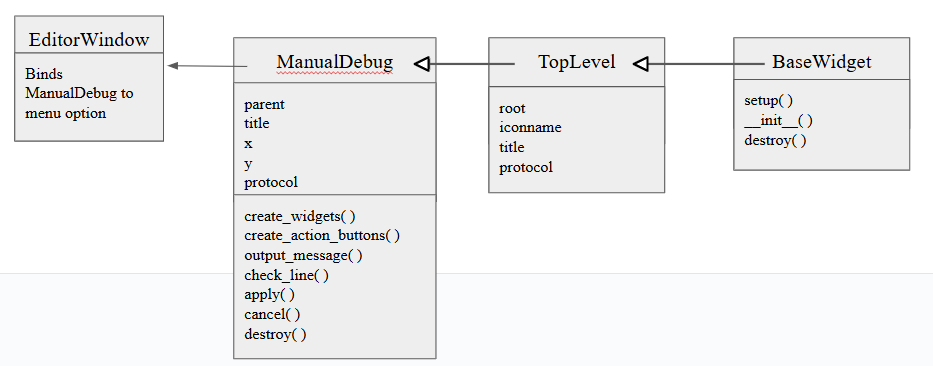

# Design Document

## Implemtation & Design Decisions

#### Better Stack Traces

- implemented the keybind for clickable stack trace to call `goto_file_line` function and adjusted the function to handle conflicts with the keybinds. We bound the `cntrl-left-click` event to attempt to navigate to the file and line corresponding to cursor's position in the stack trace. This involved modifying the `goto_file_line` function to check if it was called from the right-click menu or from this keybind which we did by using the `event` parameter. This is because we don't want to print an error message every time the user uses these keys as it could get annoying. The left click action is also responsible for positioning the cursor and focusing the window, so we ran into some issues with this dual (now tri) responsibility. By manually refocusing the user and placing the cursor in the proper spot in `goto_file_line` these issues were avoided.

- Implemented underlining the line number in error stack traces. We wanted to improve the readability of the stack trace in the shell so we implemented a feature that underlines this line number part in the error stack trace. This then helps the users quickly and visually locate where the error occured. Coupling this up with the previous implementation of the keybind for clickable stack traces makes navigating to the error quick and easy. This included modifying the `write` method in `pyshell.py` to use regular expressions to identify lines in the traceback that follow the format of `File "filename", line number, in function`. Using this regular expression we were able to split each matched line into three parts: the file name, the line number, and the rest of the context. We then inserted these parts into the Text widget while applying a special tag, `traceback_lineno`, to the line number portion. In the case where the regular expression does not match this format, we inserted the line normally without any special styling. 

- As for predicting error line, we created a menu option that can take the user to the bottom line in the stack trace (as it is often the source of the error). We felt it may be annoying for experienced programmers, but making it optional may be useful for beginners to help them learn how to read and parse a stack trace. We created a right click menu option allowing the user to call the `predict_error_event` in `pyshell.py` which identifies the current pyshell instance and iterating through the text widget in reverse order, returning and navigating the user to the proper location once the bottom line of the stack trace is reached. If no stack trace exists or another error happens, an error message is displayed to the user.

#### Syntax Errors

- implemented syntax error highlighting and message display using calltips and text tags. Logic is handled in explorer.py when `check_signal_event` is invoked based on the text being modified within a 4-second period. If the code has a syntax error, then `check_syntax` will display a calltip detailing the error message and underline the problematic line.

#### Manual Debugging

- To design the base for the ui window for manual debugging, we based the design off of the settings/config menu which inspired and helped lead us to the best classes and functions to use to cleanly create a new pop-up window. We make use of the `Text` and `Frame` classes to create the widget and allow `ManualDebug` to inheirit from `TopLevel` and `BaseWidget` to make use of the `setup()` and `destory()` functions. More elements of UI and functionality implementation can be found below.

#### Test Design

## Alternative Approach

- An alternative approach to implementing the underlining the line number of the error stack trace could have been modifying `OutputWindow.write` to accept an optional argument indicating whether the text being inserted is a line number in a traceback. By adding this additional argument such as `highlight_lineno=False`we could have conditionally applied the `traceback_lineno` tag inside hte `OutputWindow.write` method itself rather than modifying the `write` method in `pyshell.py`. This would then make it so we wouldn't have one of the bugs we challenged such as having an uninteractive shell or printing duplicate stack traces. This implementation might be more consistent and easier to maintain for the codebase. However, we decided against this because modifying this change would have meant updating all of its call sites and this could have introduced new bugs in other parts of the shell. By keeping our highlighted logic to `pyshell.py` we are able to make a specific change and maintain the expected behavior of the shell.

## Challenges We Faced 

- One of the challenges of underlining the line number in the error stack trace was identifying and isolating just the line number portion inside the traceback string. Because the traceback was just plain text, I used regular expressions to extract the filename and line numbers and then used that to apply the underlining. Additionally I tried using `OutputWindow.write` (inside `pyshell.py` `write` method) instead of `self.text.insert` to control how the traceback was displayed, but couldn't get it to work properly. When using `OutputWindow.write` to output, in the else condition, this would cause the traceback to be outputted twice. I found that working with the Text widget to give me more control.

- Continuing from the last bullet point, we didn't realize that the implementation broke some of the test cases and needed to be revisited. Additionally the shell became unresponsive with this addition: we couldn't erase text and when we typed simple expressions like `2+2` (input) the expected output `4` was missing. We found out that this was due to changing from using `OutputWindow.write()` to using `text.insert`. We chose to change this because when using the former as an implementation, two error stack traces would be printed, one with the underline and one without. To address this, we used the `iomark` in the Text widget. By setting the iomark's gravity's to `right` before inserting output we ensure that output appears bef ore any new user input and by resetting gravity to `left` we ensure that user input goes after the output which preserves the shell's expected behavior. This approach fixed the problem found from the previous bullet point's implementation and ensured that user input would remain responsive and properly positioned.

## Screenshots of our Features

Screenshot of error stack trace being underlined:

